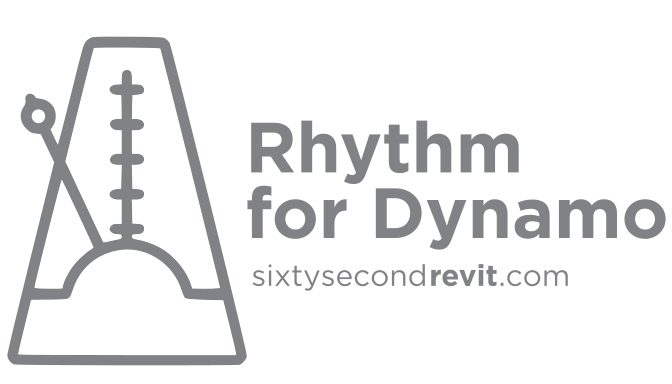

<link href="https://fonts.googleapis.com/css?family=Cookie" rel="stylesheet"><a class="bmc-button" target="_blank" href="https://www.buymeacoffee.com/j0hnp">Buy me a coffee</a>

Rhythm is a collection of custom nodes for the [Dynamo](http://www.dynamobim.org) visual programming environment. The idea is this package helps users maintain Rhythm in Revit with Dynamo. Rhythm started out as mostly out of the box Dynamo nodes used in clever ways as they apply to the Revit environment. Over time, this has changed and Rhythm is now primary a C# ZeroTouch package that adds additional functionality to Dynamo for Revit.

If you appreciate the work put into this free package, please vote in support of it on Dynamo's package manager.

## Current Version
Rhythm is currently built against the latest Dynamo stable build. At this time that is 2.0.1.

## Known Issues
- Nodes that interact with background opened documents take some more consideration. This includes running Dynamo graphs that use them in manual run mode and often times closing and opening dynamo after the process is complete. The reason this happens is Dynamo has limited document switching capability and we are exploiting this with those nodes. (Included Nodes: Applications.OpenDocumentFile, Applications.CloseDocument)

## Contributors
This package is currently managed by author of http://sixtysecondrevit.com.

## Updates
Since there is not currently an update notification process on Dynamo's package manager, I post notifications for updates on twitter.

## Examples
Examples will be available on the [wiki](https://github.com/johnpierson/RhythmForDynamo/wiki) soon,

## Help improve Rhythm
If you're interested in contributing to Rhythm, just submit a [pull request](https://github.com/sixtysecondrevit/RhythmForDynamo/pulls).

## Installation
Rhythm is available through Dynamo's built-in package manager. This provides the simplest installation for most users. If you are interested in manual install, there are some fabulous resources out there describing how to build your own Dynamo package.

## Thank you!

## What is with all the removals of DYFs?!!
With Dynamo 2.0 comes a fundamental file format change that makes anything that is a DYF or DYN (the filetypes that Dynamo uses) not backward compatible. This forced me to choose between two options. Option 1: Have 2 versions of Rhythm for each major version of Dynamo, eg. “Rhythm for Dynamo 1.x” and “Rhythm for Dynamo 2.x”. Option2: Continue my long term goals of migrating Rhythm to be fully “Zero Touch” c# code. I went with option 2 as it provides a more stable product and further compatibility.
